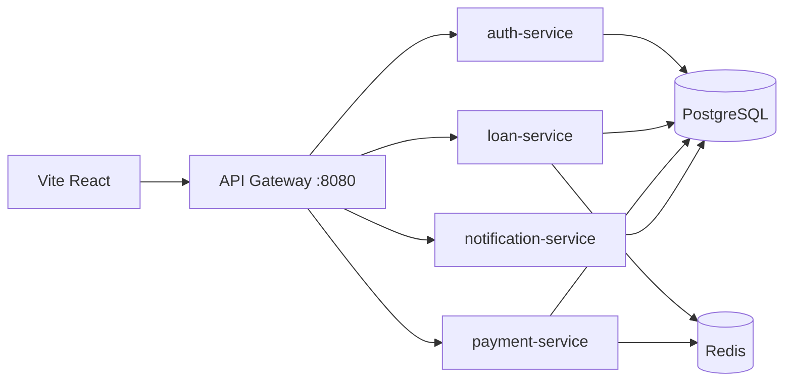

# LendLedger

**Educational loan management prototype — not licensed lending.**

Microservices LMS with reducing-balance EMI, immutable ledger, idempotent repayments, and React admin/borrower UI.

## Architecture



## Stack

- Java 17, Spring Boot 3.3, Spring Cloud Gateway
- PostgreSQL (schemas: auth, loan, payment, notification)
- Redis (rate limit, pub/sub events)
- React 18, Vite, TypeScript, Bootstrap

## Quick start (local)

### Prerequisites

- Java 17+, Maven 3.9+, Node 18+
- **Docker Desktop** (for PostgreSQL + Redis)

### Step-by-step

**Do not paste the whole block into the terminal at once** (zsh can error on comment lines like `# 1)`). Run **one command per line**, or use:

```bash
cd lendledger
bash QUICKSTART.sh
```

Manual commands:

```bash
cd lendledger
chmod +x scripts/*.sh
./scripts/bootstrap.sh
./scripts/start-infra.sh
```

Open **5 separate terminals** (one command each; wait for `Started ...Application`):

```bash
./scripts/run-auth.sh
./scripts/run-loan.sh
./scripts/run-payment.sh
./scripts/run-notification.sh
./scripts/run-gateway.sh
```

Frontend (6th terminal):

```bash
./scripts/run-frontend.sh
```

```bash
./scripts/smoke-local.sh
```

- App: http://localhost:5173  
- API: http://localhost:8080/api  

Or use Make: `make bootstrap`, `make infra`, `make test`

**Demo login:** `admin@lendledger.local` / `password`

### UI testing guide

See **[docs/UI_TESTING.md](docs/UI_TESTING.md)** for the full admin + borrower flows.

### Troubleshooting

See **[docs/LOCAL_SETUP.md](docs/LOCAL_SETUP.md)** if Maven or Docker errors appear.

### Run tests

```bash
mvn test
```

### Full Docker stack (all services in containers)

```bash
docker compose up --build
```

## Deployment (production)

**Full guide:** [docs/DEPLOYMENT.md](docs/DEPLOYMENT.md)

| Step | Action |
|------|--------|
| 1 | Push repo to GitHub |
| 2 | Neon DB + run `deploy/neon-init.sql` |
| 3 | Upstash Redis → copy `rediss://` URL |
| 4 | Render Blueprint from `render.yaml` → set secrets |
| 5 | Vercel (`frontend/`) → `VITE_API_URL=https://<gateway>/api` |
| 6 | Set gateway `CORS_ORIGIN` to your Vercel URL |

Env template: [deploy/env.example](deploy/env.example)

## API

See [docs/API.md](docs/API.md).

## Implementation plan

See [docs/IMPLEMENTATION_PLAN.md](docs/IMPLEMENTATION_PLAN.md).
