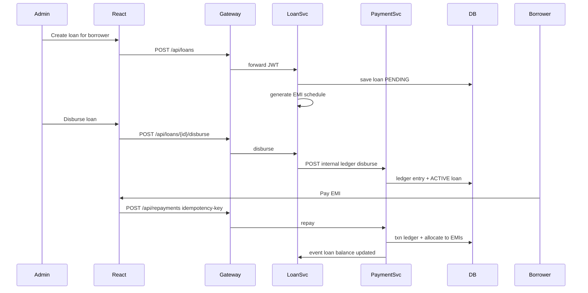
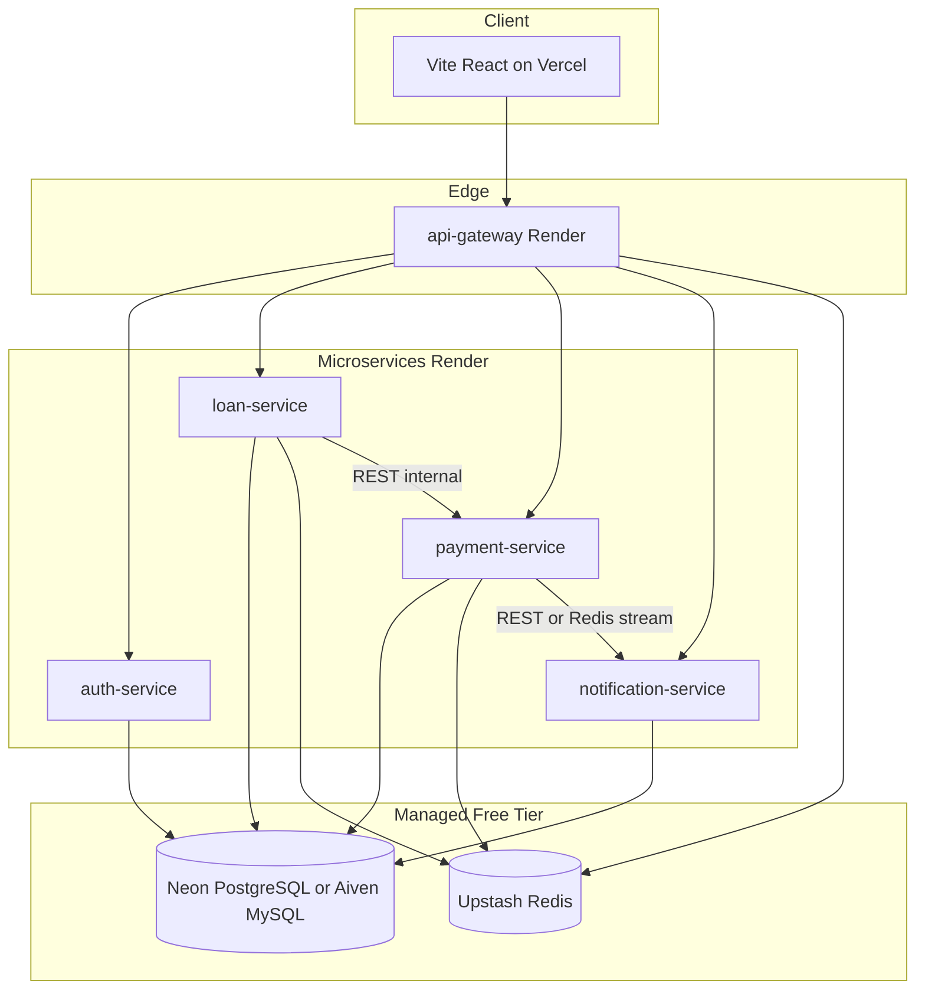

# LendLedger — End-to-End Implementation Plan

## Document purpose

This plan is written for **AI-assisted implementation** (no fixed week timeline). Deliver a portfolio-grade **Loan Management System (LMS)** labeled **“educational / prototype — not licensed lending.”**

**Stack:** Java 21, Spring Boot 3.3+, Spring Cloud Gateway, React 18 (Vite), MySQL-compatible DB, Redis, Docker, GitHub Actions.

**Architecture choice (confirmed):** **Microservices from day 1** (pragmatic free-tier: shared DB host with **per-service schemas**, not separate paid DB instances per service).

---

## 1. Product scope

### Roles

| Role | Capabilities |
|------|----------------|
| **ADMIN** (lender) | Manage borrowers, create/approve/disburse loans, view collections & overdue, run reports |
| **BORROWER** | View own loans, EMI schedule, make repayments, download statement |

### Core flows (must ship)



### Out of scope for v1 (document as future)

- Real RBI/NBFC compliance, credit bureau, legal KYC
- Real UPI/card gateway (use **mock payment** + reference ID)
- SMS (mock + log); optional email via Resend free tier later

### In scope differentiators (resume bullets)

- **Reducing-balance EMI** schedule generation
- **Immutable ledger** + balance reconciliation
- **Idempotent repayments** (`Idempotency-Key` header)
- **Daily overdue job** (scheduler)
- **JWT RBAC** + audit fields
- **Docker Compose** local + **CI/CD** + **free cloud deploy**

---

## 2. System architecture

### Services (5 deployable units)

| Service | Port (local) | Responsibility |
|---------|--------------|----------------|
| **api-gateway** | 8080 | Route `/api/**`, JWT validation, CORS, rate limit (Redis) |
| **auth-service** | 8081 | Register/login, JWT issue, refresh, roles |
| **loan-service** | 8082 | Borrowers (admin), loans, EMI schedule, disburse, loan status |
| **payment-service** | 8083 | Ledger, repayments, idempotency, allocation to EMIs |
| **notification-service** | 8084 | Overdue reminders, payment receipts (async, mock channel) |



### Inter-service communication

- **Sync:** Spring `RestClient` / OpenFeign with **internal API key** header (`X-Internal-Key`) for service-to-service calls not exposed via gateway.
- **Async (v1 light):** Redis pub/sub channels `loan.disbursed`, `payment.received`, `loan.overdue` consumed by notification-service. (Skip Kafka on free tier unless Upstash/Kafka addon is added later.)

### Database strategy (free-tier pragmatic)

**One managed database**, **separate schema per service**:

- `auth` — users, refresh_tokens
- `loan` — borrowers, loans, emi_installments
- `payment` — ledger_entries, repayments, idempotency_keys
- `notification` — notification_logs

Each service owns migrations (Flyway) only for its schema. This is acceptable for a portfolio; README should state “logical DB-per-service, physical shared instance for cost.”

**Recommended free DB:** [Neon](https://neon.tech) PostgreSQL (generous free tier, works well with Render). Use **PostgreSQL** in implementation even if resume says MySQL elsewhere—or use **Aiven free MySQL** if you require MySQL specifically.

---

## 3. Repository layout (monorepo)

Create at workspace root: `lendledger/`

```
lendledger/
├── README.md
├── docker-compose.yml
├── .github/workflows/ci.yml
├── docs/
│   ├── IMPLEMENTATION_PLAN.md      # this plan (copy full content)
│   ├── API.md                      # endpoint catalog
│   ├── DEPLOYMENT.md               # env vars + platform steps
│   └── ARCHITECTURE.md
├── frontend/                       # React Vite
│   ├── package.json
│   ├── vercel.json
│   └── src/...
├── gateway/
│   └── api-gateway/
├── services/
│   ├── auth-service/
│   ├── loan-service/
│   ├── payment-service/
│   └── notification-service/
├── shared/
│   └── lendledger-common/          # DTOs, error codes, JWT claims util
└── deploy/
    └── render.yaml                 # Blueprint multi-service
```

**Build tool:** Maven multi-module parent `pom.xml` at `lendledger/pom.xml` with modules for gateway, each service, and `lendledger-common`.

---

## 4. Domain model & SQL (per schema)

### auth schema

- **users:** `id`, `email`, `password_hash`, `role` (ADMIN/BORROWER), `full_name`, `phone`, `created_at`
- **refresh_tokens:** `id`, `user_id`, `token_hash`, `expires_at`, `revoked`

### loan schema

- **borrowers:** `id`, `user_id` (FK to auth.users), `address`, `pan_masked`, `status`
- **loans:** `id`, `borrower_id`, `principal`, `annual_rate`, `tenure_months`, `status` (PENDING/APPROVED/ACTIVE/CLOSED/DEFAULTED), `disbursed_at`, `outstanding_principal`, `created_by_admin_id`
- **emi_installments:** `id`, `loan_id`, `installment_no`, `due_date`, `emi_amount`, `principal_component`, `interest_component`, `paid_amount`, `status` (DUE/PAID/PARTIAL/OVERDUE)

### payment schema

- **ledger_entries:** `id`, `loan_id`, `entry_type` (DISBURSE/REPAYMENT/LATE_FEE/ADJUSTMENT), `amount` (signed), `reference`, `created_at`
- **repayments:** `id`, `loan_id`, `amount`, `idempotency_key` (unique), `payment_ref`, `status`, `created_at`
- **repayment_allocations:** `id`, `repayment_id`, `emi_id`, `allocated_amount`
- **idempotency_keys:** `key`, `response_hash`, `created_at`, `expires_at`

### notification schema

- **notification_logs:** `id`, `user_id`, `channel`, `template`, `payload_json`, `status`, `created_at`

---

## 5. EMI & money rules (implement exactly)

### Reducing balance EMI (monthly)

For principal `P`, annual rate `r`, tenure `n` months:

- Monthly rate `i = r / 12 / 100`
- EMI = `P * i * (1+i)^n / ((1+i)^n - 1)` (round to 2 decimals per installment; last installment adjusted for drift)

Each month:

- Interest = `outstanding * i`
- Principal component = `EMI - interest`
- Update outstanding

Store full schedule in `emi_installments` at loan **approval** (status APPROVED).

### Disbursement

- Loan → ACTIVE only if status APPROVED
- Call payment-service: ledger `DISBURSE` +amount (money out to borrower accounting)
- Set `disbursed_at`, `outstanding_principal = P`

### Repayment allocation

1. Validate idempotency key (return cached response if duplicate)
2. Start DB transaction
3. Insert repayment + ledger `REPAYMENT` (-amount from borrower debt perspective; document sign convention in README)
4. Allocate to oldest DUE/OVERDUE/PARTIAL EMIs first
5. Update EMI rows + loan `outstanding_principal`
6. If all EMIs PAID → loan CLOSED
7. Publish `payment.received` event

### Overdue job (loan-service or notification-service)

- Cron: `@Scheduled(cron = "0 0 1 * * *")` daily
- EMIs where `due_date < today` and `status != PAID` → OVERDUE
- Loan with any OVERDUE → flag; publish `loan.overdue` for notification-service

---

## 6. API contract (gateway paths)

Base URL local: `http://localhost:8080/api`

### Auth (`/api/auth/**` → auth-service)

| Method | Path | Role | Description |
|--------|------|------|-------------|
| POST | `/auth/register` | public | Register borrower (admin created separately) |
| POST | `/auth/login` | public | Returns access + refresh JWT |
| POST | `/auth/refresh` | public | Refresh token |
| GET | `/auth/me` | any | Current user |

### Admin borrowers & loans (`/api/**` → loan-service)

| Method | Path | Role | Description |
|--------|------|------|-------------|
| POST | `/admin/borrowers` | ADMIN | Link user + borrower profile |
| GET | `/admin/borrowers` | ADMIN | List/search |
| POST | `/admin/loans` | ADMIN | Create loan PENDING |
| POST | `/admin/loans/{id}/approve` | ADMIN | Generate EMI, APPROVED |
| POST | `/admin/loans/{id}/disburse` | ADMIN | ACTIVE + ledger |
| GET | `/admin/loans` | ADMIN | Filters: status, overdue |
| GET | `/admin/reports/collections` | ADMIN | Sum repayments by date range |
| GET | `/admin/reports/overdue` | ADMIN | Overdue EMIs |

### Borrower (`/api/**` → loan/payment)

| Method | Path | Role | Description |
|--------|------|------|-------------|
| GET | `/borrower/loans` | BORROWER | Own loans |
| GET | `/borrower/loans/{id}/schedule` | BORROWER | EMI schedule |
| POST | `/borrower/loans/{id}/repay` | BORROWER | Header `Idempotency-Key` |
| GET | `/borrower/loans/{id}/statement` | BORROWER | Ledger + repayments |

### Payment internal (not via gateway)

- `POST /internal/ledger/disburse` — loan-service only
- `POST /internal/ledger/repayment` — called from payment-service itself

Publish OpenAPI JSON per service under `/v3/api-docs` aggregated in gateway optional.

---

## 7. Cross-cutting concerns

### Security

- **JWT access** (15m) + **refresh** (7d) HS256 or RS256 (HS256 simpler for portfolio)
- Gateway validates JWT; forwards `X-User-Id`, `X-Role` headers to downstream (or re-validate in each service for defense in depth)
- BCrypt passwords
- CORS: allow Vercel preview + production origin only
- Rate limit login: 5/min per IP via Redis in gateway

### Error handling

- Standard envelope in `lendledger-common`: `{ "error": { "code", "message", "traceId" } }`
- Global `@ControllerAdvice` per service

### Observability

- Spring Actuator `/actuator/health` on each service (Render health check)
- Correlation ID `X-Request-Id` propagated across calls
- Structured JSON logging

### Testing (minimum)

- Unit: EMI calculator, allocation logic
- Integration: Testcontainers PostgreSQL per service
- Contract: smoke tests via gateway with RestAssured
- CI runs `mvn test` + `npm test` on PR

---

## 8. React frontend plan

### Tech

- **Vite + React 18 + TypeScript**
- **React Router** — routes below
- **TanStack Query** — server state
- **Axios** — base URL from `VITE_API_URL`
- **Tailwind CSS** or MUI (pick one, stay consistent)
- Token storage: `httpOnly` cookie ideal; portfolio acceptable: memory + refresh in `sessionStorage` with XSS caution documented

### Pages

| Route | Role | Features |
|-------|------|----------|
| `/login` | all | Login form |
| `/admin/dashboard` | ADMIN | KPI cards: active loans, overdue count, today collections |
| `/admin/borrowers` | ADMIN | CRUD list, create borrower |
| `/admin/loans` | ADMIN | Create loan form, approve, disburse actions |
| `/admin/loans/:id` | ADMIN | Schedule table, ledger view |
| `/admin/reports` | ADMIN | Collections + overdue export CSV |
| `/borrower/dashboard` | BORROWER | My loans summary |
| `/borrower/loans/:id` | BORROWER | Schedule + pay modal (mock payment ref) |
| `/borrower/statement/:id` | BORROWER | Transaction history |

### UX requirements

- Loading/error states on all mutations
- Disable double-submit on repay; generate UUID idempotency key client-side
- Amount formatting INR (`en-IN`)
- Responsive tables

### Frontend env

```env
VITE_API_URL=https://lendledger-gateway.onrender.com/api
```

---

## 9. Local development (Docker Compose)

`docker-compose.yml` services:

- `postgres` (16) with init script creating schemas
- `redis` (7)
- `auth-service`, `loan-service`, `payment-service`, `notification-service`, `api-gateway` (build from Dockerfiles)
- **Optional:** do not containerize frontend; run `npm run dev` with proxy to gateway

**Profiles:** `docker compose up` for full stack; document seed script:

- 1 admin: `admin@lendledger.local` / password
- 2 borrowers with sample ACTIVE loan

Maven: `./mvnw -pl services/loan-service spring-boot:run` for single-service debug.

---

## 10. Deployment plan (free platforms)

### Platform mapping (what works)

| Component | Platform | Notes |
|-----------|----------|-------|
| React static | **Vercel** | Connect `frontend/`, build `npm run build`, output `dist` |
| Spring services (x5) | **Render** | One Web Service per service via `render.yaml` Blueprint |
| PostgreSQL | **Neon** | Free tier; set `DATABASE_URL` per schema connection string |
| Redis | **Upstash** | Free Redis; TLS URL |
| CI | **GitHub Actions** | Test on push; optional deploy on `main` |

**Not suitable for Spring Boot:** Vercel/Netlify serverless for JVM backend (skip). Netlify optional only if you duplicate marketing site.

### Render constraints (document in DEPLOYMENT.md)

- Free web services **spin down** after ~15 min idle → cold start 30–60s
- **512 MB RAM** — use JVM flags: `-Xmx384m -XX:+UseContainerSupport`
- 5 services = 5 Render free services (within account limits; verify current Render free tier policy)

### `render.yaml` sketch (deploy/render.yaml)

- Define 5 `type: web` services from monorepo `rootDir` + `dockerfilePath`
- Each service env: `SPRING_PROFILES_ACTIVE=prod`, `DATABASE_URL`, `REDIS_URL`, `JWT_SECRET`, `INTERNAL_API_KEY`
- Gateway env: `AUTH_SERVICE_URL`, `LOAN_SERVICE_URL`, etc. (Render private networking or public `.onrender.com` URLs)

### Vercel (`frontend/vercel.json`)

```json
{
  "rewrites": [{ "source": "/(.*)", "destination": "/index.html" }]
}
```

Set CORS on gateway to `https://<project>.vercel.app`.

### Secrets checklist

- `JWT_SECRET` (shared across auth + gateway validation)
- `INTERNAL_API_KEY`
- `DATABASE_URL` (per service, same host different schema/search_path)
- `UPSTASH_REDIS_URL`
- `VITE_API_URL` in Vercel

### Alternative if Render limits hit

- Collapse **notification-service** into **loan-service** as a module (still separate package in monorepo) for 4 deployables
- Or host **gateway + auth** on one JVM and **loan + payment** on second (modular monolith deploy) — only as fallback

### GitHub Actions deploy flow

1. On push `main`: build & test Maven + npm
2. Render auto-deploy via GitHub integration (preferred) OR deploy hook URLs
3. Vercel auto-deploy `frontend/` on push

---

## 11. Implementation phases (for AI executor)

Execute in order; each phase ends with runnable checkpoint.

### Phase 0 — Scaffold

- Monorepo parent POM, Java 21, Spring Boot 3.3, Spring Cloud 2023.0.x
- `lendledger-common` module
- Empty services with Actuator health
- `docker-compose.yml` + Postgres schemas
- README disclaimer (educational prototype)

### Phase 1 — Auth

- auth-service: register, login, refresh, Flyway `auth` schema
- JWT util in common
- gateway routes `/api/auth/**`
- React login page + auth context

### Phase 2 — Loan core

- loan-service: borrowers, create loan, approve + EMI generation
- Admin React pages: borrowers, create/approve loan
- Unit tests for EMI calculator

### Phase 3 — Payment & ledger

- payment-service: disburse internal API, repay with idempotency, allocations
- loan-service disburse orchestration
- Gateway routes for admin disburse + borrower repay
- React pay flow with idempotency key

### Phase 4 — Borrower & reports

- Borrower-facing APIs + statement
- Admin reports (collections, overdue)
- React borrower dashboard + reports

### Phase 5 — Notifications & jobs

- notification-service Redis subscribers
- Overdue scheduled job
- Mock email/log notification

### Phase 6 — Hardening

- Rate limits, validation, audit `created_by`
- Integration tests, seed data
- OpenAPI docs in `docs/API.md`

### Phase 7 — Deploy

- Dockerfiles per service (multi-stage build)
- `render.yaml`, Neon, Upstash provisioning docs
- Vercel frontend + env configuration
- Smoke test script `scripts/smoke.sh` against production URLs

---

## 12. Dockerfile pattern (each service)

```dockerfile
FROM eclipse-temurin:21-jre-alpine
WORKDIR /app
COPY target/*.jar app.jar
ENV JAVA_OPTS="-Xmx384m -XX:+UseContainerSupport"
EXPOSE 8080
ENTRYPOINT ["sh", "-c", "java $JAVA_OPTS -jar app.jar"]
```

Build from monorepo: `mvn -pl services/loan-service -am package -DskipTests`.

---

## 13. Resume / README deliverables

README must include:

- Architecture diagram (mermaid)
- Local setup commands
- Live demo links (Vercel + Render gateway)
- **Sample metrics** after load test (even modest): e.g. “repay API p95 120ms @ 50 concurrent”
- Compliance disclaimer

**Resume bullets (template):**

- Built **LendLedger**, a microservices LMS (Spring Boot, PostgreSQL, Redis) with reducing-balance EMI, ledger-based repayments, and idempotent payment APIs.
- Deployed on **Render + Vercel** with Docker, GitHub Actions CI, and schema-isolated services on a shared managed database.

---

## 14. File to create first

When implementation starts, write the full plan into:

**[`lendledger/docs/IMPLEMENTATION_PLAN.md`](lendledger/docs/IMPLEMENTATION_PLAN.md)**

Copy sections 1–13 from this document, plus append:

- Appendix A: Flyway migration file names per service
- Appendix B: Full entity field lists
- Appendix C: Render/Vercel click-by-click setup
- Appendix D: AI implementation checklist (tick boxes per phase)

---

## 15. Risk & mitigation

| Risk | Mitigation |
|------|------------|
| Render cold starts | Show loading UI; document; upgrade to paid if demo critical |
| 5 services exceed free limits | Merge notification into loan-service deploy |
| EMI rounding drift | Adjust last installment principal |
| Double repayment | Idempotency table + DB unique constraint |
| CORS failures | Centralize allowed origins in gateway config |

---

## Summary

**LendLedger** is a microservices LMS with auth, loan/EMI, payment/ledger, and notification services; React admin/borrower UI; Redis for rate limit/events; shared Neon Postgres with per-service schemas; local Docker Compose; production on **Vercel (React) + Render (Spring) + Upstash + Neon**. Implementation proceeds in 8 phases from scaffold through deploy, optimized for AI step-by-step execution without a fixed calendar.

---

## Appendix A: Flyway migration files

| Service | File |
|---------|------|
| auth-service | `V1__init_auth.sql` |
| loan-service | `V1__init_loan.sql` |
| payment-service | `V1__init_payment.sql` |
| notification-service | `V1__init_notification.sql` |

## Appendix B: Entity field lists

See source entities in each service `domain/` package and Section 4 of this document.

## Appendix C: Render / Vercel setup

See [DEPLOYMENT.md](./DEPLOYMENT.md).

## Appendix D: Implementation checklist

- [x] Phase 0 — Monorepo scaffold, Docker Compose, common module
- [x] Phase 1 — Auth service, gateway JWT, React login
- [x] Phase 2 — Loan service, EMI calculator, admin UI
- [x] Phase 3 — Payment service, ledger, idempotent repay
- [x] Phase 4 — Borrower APIs, reports, statement UI
- [x] Phase 5 — Notification service, Redis listeners, overdue job
- [x] Phase 6 — Rate limit, seed data, EMI unit test
- [x] Phase 7 — Dockerfiles, render.yaml, CI, smoke script, docs
